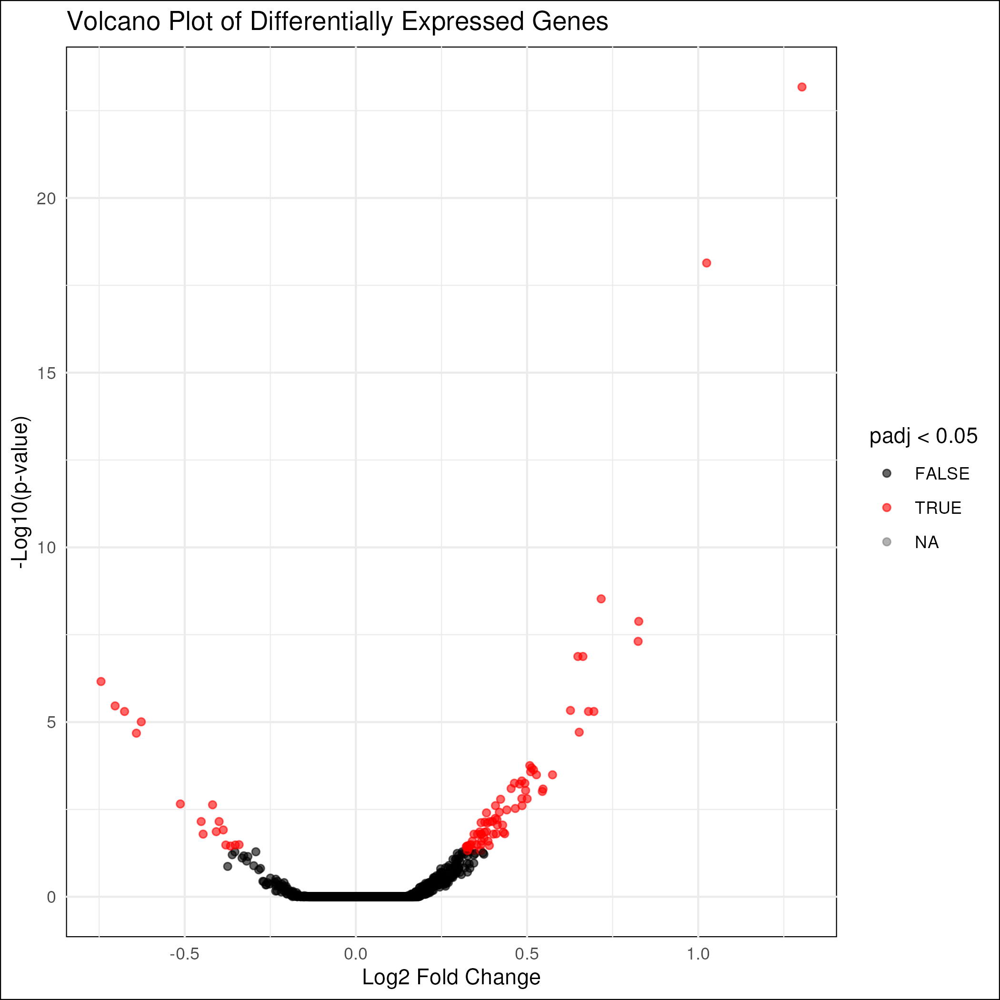
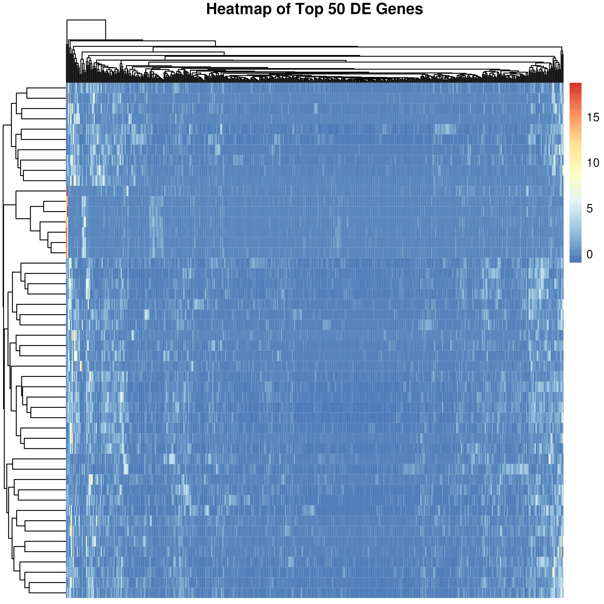
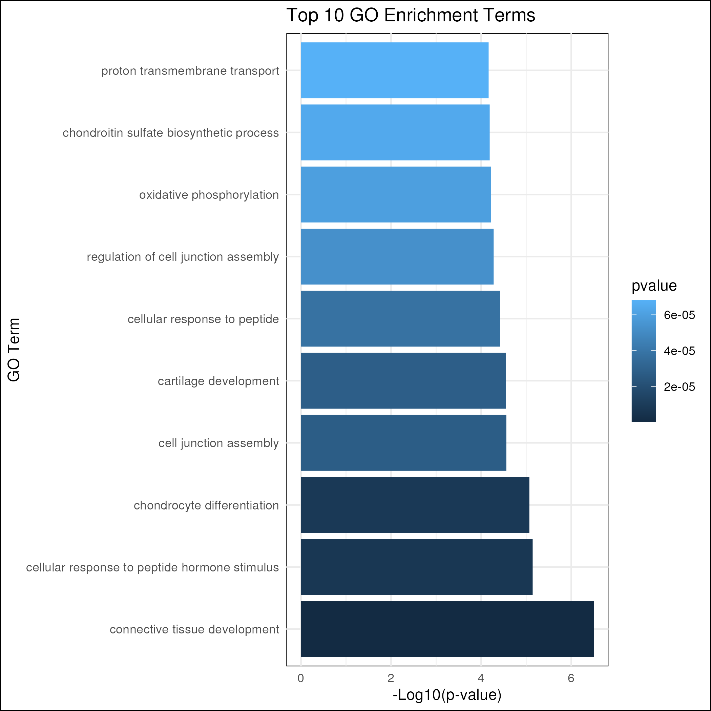

# Differential Expression Analysis Pipeline - BIOF501 Project

Author: [Kevin Zhang]

## 1) Background

### Alzheimer’s Disease
Alzheimer’s disease (AD) is a progressive neurodegenerative disorder and the most common cause of dementia globally. The disease is characterized by hallmark pathological features, including the accumulation of amyloid-beta (Aβ) plaques, neurofibrillary tangles of hyperphosphorylated tau protein, and widespread neuronal loss [[1](#6-references)]. Alongside these pathological hallmarks, neuroinflammation driven by microglial cells—the brain's resident immune cells—has emerged as an important factor in the disease’s progression. Microglia play a dual role in AD, potentially contributing to both protective and pathological processes, such as clearing Aβ plaques or exacerbating neuronal damage through chronic inflammation [[2](#6-references)]. Understanding the molecular mechanisms underlying microglial responses in AD could offer new insights into disease progression and therapeutic targets.

### RNA Sequencing and Single-Cell Technologies
RNA sequencing (RNA-seq) is a high-throughput technique that enables the comprehensive profiling of gene expression by sequencing the entire transcriptome. This technology allows researchers to quantify RNA abundance, identify novel transcripts, and detect alternative splicing events [[3](#6-references)]. In traditional bulk RNA-seq, gene expression is measured across a population of cells, providing an average signal but potentially masking cellular heterogeneity [[4](#6-references)]. Single-cell (scRNA-seq) and single-nucleus RNA sequencing (snRNA-seq) technologies overcome this limitation by profiling gene expression at the level of individual cells or nuclei, respectively. These methods enable the identification of distinct cell types, states, and transcriptional programs within complex tissues, offering unprecedented insights into cellular heterogeneity and dynamics [[5](#6-references)].

### Differential Expression Analysis in Alzheimer’s Disease Microglia
Differential expression analysis involves comparing gene expression levels between different experimental conditions, groups, or cell states to identify genes with significant changes in activity [[6](#6-references)]. Applying this analysis to sc/snRNA-seq data from microglial cells in Alzheimer’s disease can reveal transcriptional alterations associated with disease pathology. Specifically, such studies can help identify genes and pathways that distinguish disease-associated microglia and drive pathological responses, such as neuroinflammation or impaired clearance of Aβ plaques [[7](#6-references)].

Thus, by applying sc/snRNA-seq differential expression analysis to an AD dataset in a reproducible fashion, this pipeline aims to further investigate gene expression patterns in AD microglial cells, providing insight into potentially important AD-associated genes and pathways.

---

## 2) Workflow Overview

This pipeline processes `.rds` files containing Seurat objects as input. It includes the following steps:

1. **Data Loading**: Uses the Seurat package to extract a raw counts matrix and a metadata matrix from the input Seurat `.rds` file.  
2. **Differential Expression Analysis**: Uses the DESeq2 package to find differentially expressed genes based on the extracted raw counts and metadata matrices from the data loading step.  
3. **Gene Ontology Analysis**: Uses the clusterProfiler package to perform GO enrichment based on the differential expression analysis results from the previous step.  
4. **Visualization**: Generates a volcano plot, a heatmap of top DE genes, and a bar plot of enriched GO terms based on the results from the previous differential expression and gene ontology analyses.

A visual diagram displaying the pipeline workflow can be seen below:


### 2.1 Software Package Versions

This pipeline uses a custom docker image, which can be viewed on DockerHub [here](https://hub.docker.com/r/kzhang04/de-pipeline). The image is automatically retrieved and downloaded from DockerHub when running the workflow, and the dockerfile for building the image can also be found in this repository. All steps were run using `R v4.3.1`.

The package versions for the core software packages used are detailed below:

```r
# R Packages; Format is [package] - [version]
Seurat - v5.0.1
SeuratObject - v5.0.1
DESeq2 - latest
clusterProfiler - latest
org.Hs.eg.db - latest
tidyverse - latest
pheatmap - latest
```

```bash
# Core Dependencies; Format is [software] - [version]
nextflow - v24.10.1
docker - v27.3.1
java - v17.0.10
```

---

## 3) Installation and Usage

This repository has test data included under the './data/' directory which is automatically input into the pipeline when the pipeline is run. To run the pipeline with the included test data, follow the below steps:

1. **Install Dependencies**  
   Install the required software: [Git](https://git-scm.com/downloads), [Nextflow](https://www.nextflow.io/docs/latest/install.html), [Docker](https://docs.docker.com/get-docker/), and [Java](https://www.oracle.com/ca-en/java/technologies/downloads/). The specific versions used for this pipeline can be found in the above Software Package Versions section.

2. **Clone the Repository and Navigate to Project Directory**  
   ```bash
   git clone https://github.com/kzhang04/BIOF501-Project.git
   cd BIOF501-Project/
   ```

3. **Run the Pipeline with Docker Running**  
   Make sure Docker is running in the system background and execute the pipeline with the included test data using the following command:
   ```bash
   nextflow run main.nf
   ```

## 4) Inputs

By default, the pipeline takes as input the `.rds` test data file included under the './data/' directory of this repository (./data/AD_microglia_data.rds). The test data is a Seurat object containing snRNA-seq data from 500 total microglial cells, from Alzheimer's Disease patients and healthy individuals, filtered and subsampled from a larger dataset (which can be found here on [CellxGene](https://cellxgene.cziscience.com/collections/0d35c0fd-ef0b-4b70-bce6-645a4660e5fa)). The dataset has the following metadata:

- **Number of Samples:** 46
- **Sexes of Samples:** Male/Female
- **Disease State:** Alzheimer's Disease/Normal

If you choose to use a different input data file, the input file path parameter can be modified in `nextflow.config`. However, the input must still be in the form of a Seurat object for the pipeline to run properly.

Below is a description of the input parameters for each individual process in the pipeline:

1. **loadData:** Takes as input the `AD_microglia_data.rds` file containing a Seurat object.
2. **differentialExpression:** Takes as input two `.rds` files (`counts_matrix.rds` and `metadata.rds`), which are outputted by the previous `loadData` process and contain the raw counts and metadata matrices, respectively.
3. **geneOntology:** Takes as input the `de_results.rds` file, which is outputted by the previous `differentialExpression` process and contains the differential expression analysis results.
4. **plotResults:** Takes as input three `.rds` files (`counts_matrix.rds`, `de_results.rds`, and `go_results.rds`), which are outputted by all three previous processes and contain the raw counts matrix, differential expression analysis results, and gene ontology enrichment analysis results, respectively.

## 5) Outputs

 After running the pipeline with the test data, outputs from each process in the pipeline will be stored in the `./results/` directory with the following structure:

```bash
results/
├── loading/
│   ├── metadata.rds
│   └── counts_matrix.rds
├── DE/
│   └── de_results.rds
├── GO/
│   └── go_results.rds
├── visualizations/
│   ├── volcano_plot.png
│   ├── heatmap.png
│   └── go_bar_plot.png
```

- The `./results/loading/` directory should contain the `counts_matrix.rds` and `metadata.rds` files, which store the extracted raw counts and metadata matrices, respectively, from the input `AD_microglia_data.rds` file.
- The `./results/DE/` directory should contain the `de_results.rds` file, which stores the results of the differential gene expression analysis as a DESeq2 object.
- The `./results/GO/` directory should contain the `go_results.rds` file, which stores the results of the gene ontology enrichment analysis as a DOSE object.
- The `./results/visualizations/` directory should contain the `volcano_plot.png`, `heatmap.png`, and `go_bar_plot.png` images, which are visualizations of the results of the differential expression and gene ontology enrichment analyses.

Below are the expected outputs for the visualizations:

1. **Volcano Plot of Differentially Expressed Genes** (`./results/visualizations/volcano_plot.png`)  
   A scatter plot showing differentially expressed genes between microglial cells from the 'Alzheimer's disease' and 'normal' conditions. Genes with adjusted p-values < 0.05 are highlighted in red.

<figure>
    
</figure>

2. **Heatmap** (`heatmap.png`)  
   A heatmap showing clustering of expression levels for the top 50 significant differentially expressed genes between microglial cells from the 'Alzheimer's disease' and 'normal' conditions.  

<figure>
    
</figure>

3. **GO Bar Plot** (`go_bar_plot.png`)  
   A bar plot displaying the top 10 enriched GO terms ranked by p-value, for microglial cells from the 'Alzheimer's disease' condition compared to the 'normal' condition.

<figure>
    
</figure>

---

## 6) References

[1] Zhang, XX., Tian, Y., Wang, ZT. et al. The Epidemiology of Alzheimer’s Disease Modifiable Risk Factors and Prevention. J Prev Alzheimers Dis 8, 313–321 (2021). https://doi.org/10.14283/jpad.2021.15

[2] Yang, J., Wise, L., & Fukuchi, K. TLR4 Cross-Talk With NLRP3 Inflammasome and Complement Signaling Pathways in Alzheimer's Disease. Front Immunol 11:724 (2020). https://doi.org/10.3389/fimmu.2020.00724

[3] Wang, Z., Gerstein, M., & Snyder, M. RNA-Seq: a revolutionary tool for transcriptomics. Nat Rev Genet 10(1), 57-63 (2009). https://doi.org/10.1038/nrg2484

[4] Yu, X., Abbas-Aghababazadeh, F., Chen, YA., & Fridley, BL. Statistical and Bioinformatics Analysis of Data from Bulk and Single-Cell RNA Sequencing Experiments. Methods Mol Biol 2194, 143-175 (2021). https://doi.org/10.1007/978-1-0716-0849-4_9

[5] Jovic, D., Liang, X., Zeng, H., Lin, L., Xu, F., & Luo, Y. Single-cell RNA sequencing technologies and applications: A brief overview. Clinical and translational medicine, 12(3), e694 (2022). https://doi.org/10.1002/ctm2.694

[6] Rosati, D., Palmieri, M., Brunelli, G., Morrione, A., Iannelli, F., Frullanti, E., & Giordano, A. Differential gene expression analysis pipelines and bioinformatic tools for the identification of specific biomarkers: A review. Comput Struct Biotechnol J 23, 1154-1168 (2024). https://doi.org/10.1016/j.csbj.2024.02.018

[7] Xu, J., Zhang, P., Huang, Y. et al. Multimodal single-cell/nucleus RNA sequencing data analysis uncovers molecular networks between disease-associated microglia and astrocytes with implications for drug repurposing in Alzheimer's disease. Genome Res 31, 1900-1912 (2021). https://doi.org/10.1101/gr.272484.120

---
